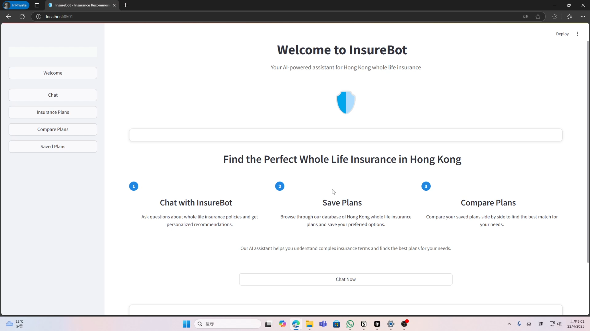
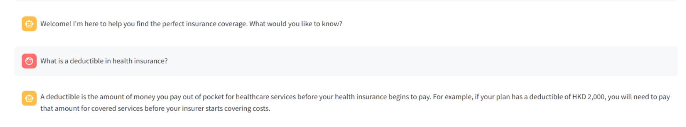
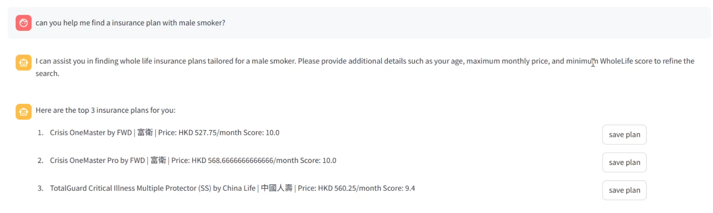
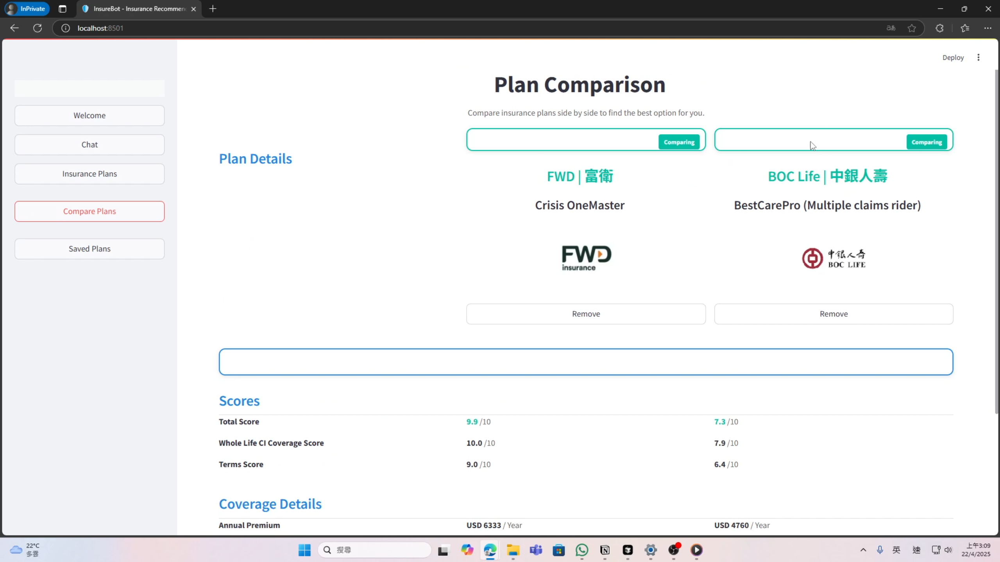
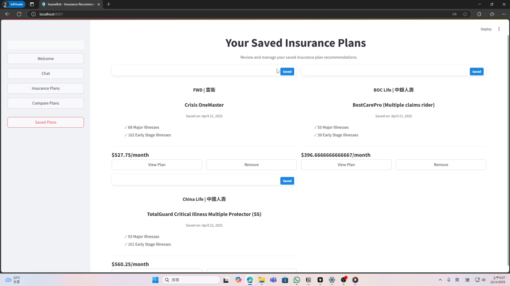

# InsureBot - Insurance Recommendation Chatbot

A Streamlit-based AI-powered insurance chatbot application that helps users find the perfect insurance coverage for their needs.

## Features

- Interactive multi-screen user interface
- User profile setup
- Insurance needs assessment
- AI-powered chat assistant
- Personalized insurance recommendations
- Side-by-side plan comparison
- Saved plans management
- User settings management

## Prerequisites

- Python 3.8+
- pip (Python package manager)

## Installation

1. Clone the repository:
```bash
git clone <repository-url>
cd <repository-directory>
```

2. Create a virtual environment (optional but recommended):
```bash
# On Windows
python -m venv venv
venv\Scripts\activate

# On macOS/Linux
python -m venv venv
source venv/bin/activate
```

3. Install the required packages:
```bash
pip install -r requirements.txt
```

## Running the Application

Run the Streamlit application:
```bash
streamlit run app.py
```

This will start the application and automatically open it in your default web browser. If it doesn't open automatically, you can access it at http://localhost:8501.

## Usage

1. **Welcome Screen**: Introduction to the application features

2. **Chat**: Interact with the AI assistant for personalized advice

3. **Recommendations**: Browse recommended insurance plans

4. **Comparison**: Compare multiple plans side by side

5. **Saved Plans**: View and manage saved insurance plans


## Development

The application is built with:
- Streamlit for the user interface
- Pandas for data handling
- Plotly and Matplotlib for visualization